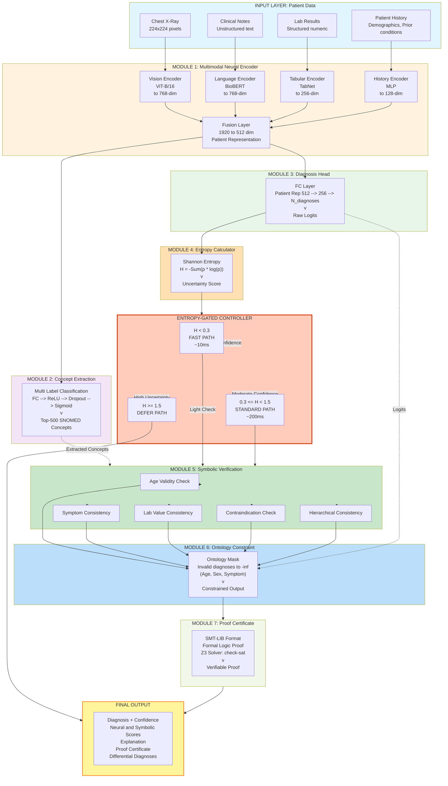

# MedSymbol Architecture & Data Flow

## Diagram: Full System Architecture

```mermaid
graph TD
    subgraph INPUT[INPUT LAYER: Patient Data]
        CXR["Chest X-Ray<br>224x224 pixels"]
        NOTES["Clinical Notes<br>Unstructured text"]
        LABS["Lab Results<br>Structured numeric"]
        HISTORY["Patient History<br>Demographics, Prior conditions"]
    end

    subgraph MODULE1[MODULE 1: Multimodal Neural Encoder]
        VIT["Vision Encoder<br>ViT-B/16<br>to 768-dim"]
        BIOBERT["Language Encoder<br>BioBERT<br>to 768-dim"]
        TABNET["Tabular Encoder<br>TabNet<br>to 256-dim"]
        MLP1["History Encoder<br>MLP<br>to 128-dim"]
        FUSION["Fusion Layer<br>1920 to 512 dim<br>Patient Representation"]
    end

    subgraph MODULE2[MODULE 2: Concept Extraction]
        CONCEPTS["Multi Label Classification<br>FC --> ReLU --> Dropout --> Sigmoid<br>v<br>Top-500 SNOMED Concepts"]
    end

    subgraph MODULE3[MODULE 3: Diagnosis Head]
        DIAG_HEAD["FC Layer<br>Patient Rep 512 --> 256 --> N_diagnoses<br>v<br>Raw Logits"]
    end

    subgraph MODULE4[MODULE 4: Entropy Calculator]
        ENTROPY["Shannon Entropy<br>H = -Sum(p * log(p))<br>v<br>Uncertainty Score"]
    end

    subgraph GATE[ENTROPY-GATED CONTROLLER]
        LOW["H < 0.3<br>FAST PATH<br>~10ms"]
        MID["0.3 <= H < 1.5<br>STANDARD PATH<br>~200ms"]
        HIGH["H >= 1.5<br>DEFER PATH"]
    end

    subgraph MODULE5[MODULE 5: Symbolic Verification]
        AGE["Age Validity Check"]
        SYMPTOM["Symptom Consistency"]
        LAB_CHECK["Lab Value Consistency"]
        CONTRA["Contraindication Check"]
        HIER["Hierarchical Consistency"]
    end

    subgraph MODULE6[MODULE 6: Ontology Constraint]
        MASK["Ontology Mask<br>Invalid diagnoses to -inf<br>(Age, Sex, Symptom)<br>v<br>Constrained Output"]
    end

    subgraph MODULE7[MODULE 7: Proof Certificate]
        SMT["SMT-LIB Format<br>Formal Logic Proof<br>Z3 Solver: check-sat<br>v<br>Verifiable Proof"]
    end

    subgraph OUTPUT[FINAL OUTPUT]
        FINAL["Diagnosis + Confidence<br>Neural and Symbolic Scores<br>Explanation<br>Proof Certificate<br>Differential Diagnoses"]
    end

    CXR --> VIT
    NOTES --> BIOBERT
    LABS --> TABNET
    HISTORY --> MLP1
    
    VIT --> FUSION
    BIOBERT --> FUSION
    TABNET --> FUSION
    MLP1 --> FUSION
    
    FUSION --> CONCEPTS
    FUSION --> DIAG_HEAD
    
    CONCEPTS -.->|Extracted Concepts| MODULE5
    DIAG_HEAD --> ENTROPY
    
    ENTROPY --> GATE
    
    GATE -->|High Confidence| LOW
    GATE -->|Moderate Confidence| MID
    GATE -->|High Uncertainty| HIGH
    
    LOW -->|Light Check| MODULE5
    MID --> MODULE5
    HIGH --> OUTPUT
    
    MODULE5 --> AGE
    MODULE5 --> SYMPTOM
    MODULE5 --> LAB_CHECK
    MODULE5 --> CONTRA
    MODULE5 --> HIER
    
    AGE --> MASK
    SYMPTOM --> MASK
    LAB_CHECK --> MASK
    CONTRA --> MASK
    HIER --> MASK
    
    MASK --> MODULE7
    
    MODULE7 --> OUTPUT
    
    DIAG_HEAD -.->|Logits| MASK
    
    style INPUT fill:#e1f5ff
    style MODULE1 fill:#fff3e0
    style MODULE2 fill:#f3e5f5
    style MODULE3 fill:#e8f5e9
    style MODULE4 fill:#ffe0b2
    style GATE fill:#ffccbc,stroke:#d84315,stroke-width:3px
    style MODULE5 fill:#c8e6c9
    style MODULE6 fill:#bbdefb
    style MODULE7 fill:#f1f8e9
    style OUTPUT fill:#fff59d,stroke:#f57f17,stroke-width:2px
```
