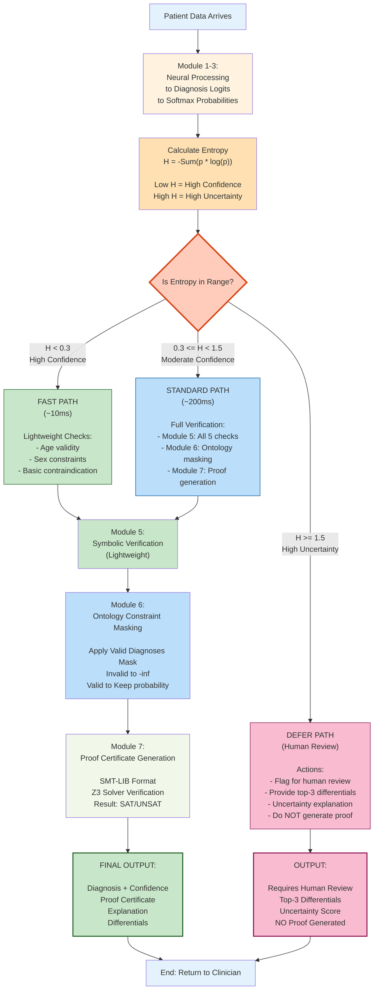

# MedSymbol 3-Path Inference Workflow

## Diagram: Entropy-Gated Decision Logic

```mermaid
graph TD
    START["Patient Data Arrives"] --> MODULE1["Module 1-3:<br>Neural Processing<br>to Diagnosis Logits<br>to Softmax Probabilities"]
    
    MODULE1 --> ENTROPY["Calculate Entropy<br>H = -Sum(p * log(p))<br><br>Low H = High Confidence<br>High H = High Uncertainty"]
    
    ENTROPY --> DECISION{"Is Entropy in Range?"}
    
    DECISION -->|H < 0.3<br>High Confidence| FAST["FAST PATH<br>(~10ms)<br><br>Lightweight Checks:<br>- Age validity<br>- Sex constraints<br>- Basic contraindication"]
    
    DECISION -->|0.3 <= H < 1.5<br>Moderate Confidence| STANDARD["STANDARD PATH<br>(~200ms)<br><br>Full Verification:<br>- Module 5: All 5 checks<br>- Module 6: Ontology masking<br>- Module 7: Proof generation"]
    
    DECISION -->|H >= 1.5<br>High Uncertainty| DEFER["DEFER PATH<br>(Human Review)<br><br>Actions:<br>- Flag for human review<br>- Provide top-3 differentials<br>- Uncertainty explanation<br>- Do NOT generate proof"]
    
    FAST --> MODULE5["Module 5:<br>Symbolic Verification<br>(Lightweight)"]
    STANDARD --> MODULE5
    
    MODULE5 --> MODULE6["Module 6:<br>Ontology Constraint Masking<br><br>Apply Valid Diagnoses Mask<br>Invalid to -inf<br>Valid to Keep probability"]
    
    MODULE6 --> MODULE7["Module 7:<br>Proof Certificate Generation<br><br>SMT-LIB Format<br>Z3 Solver Verification<br>Result: SAT/UNSAT"]
    
    MODULE7 --> OUTPUT["FINAL OUTPUT:<br><br>Diagnosis + Confidence<br>Proof Certificate<br>Explanation<br>Differentials"]
    
    DEFER --> HUMAN_OUT["OUTPUT:<br><br>Requires Human Review<br>Top-3 Differentials<br>Uncertainty Score<br>NO Proof Generated"]
    
    OUTPUT --> END["End: Return to Clinician"]
    HUMAN_OUT --> END
    
    style START fill:#e3f2fd
    style MODULE1 fill:#fff3e0
    style ENTROPY fill:#ffe0b2
    style DECISION fill:#ffccbc,stroke:#d84315,stroke-width:3px
    style FAST fill:#c8e6c9,stroke:#1b5e20
    style STANDARD fill:#bbdefb,stroke:#01579b
    style DEFER fill:#f8bbd0,stroke:#880e4f
    style MODULE5 fill:#c8e6c9
    style MODULE6 fill:#bbdefb
    style MODULE7 fill:#f1f8e9
    style OUTPUT fill:#c8e6c9,stroke:#1b5e20,stroke-width:2px
    style HUMAN_OUT fill:#f8bbd0,stroke:#880e4f,stroke-width:2px
    style END fill:#e3f2fd
```
