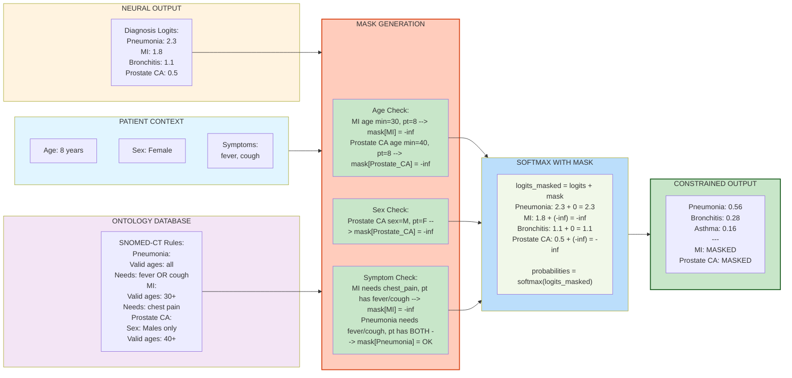

# MedSymbol Ontology Constraint Masking

## Diagram: Age, Sex, & Symptom-Based Filtering

```mermaid
graph LR
    subgraph INPUT[NEURAL OUTPUT]
        LOGITS["Diagnosis Logits:<br>Pneumonia: 2.3<br>MI: 1.8<br>Bronchitis: 1.1<br>Prostate CA: 0.5"]
    end
    
    subgraph PATIENT_INFO[PATIENT CONTEXT]
        AGE["Age: 8 years"]
        SEX["Sex: Female"]
        SYMPTOMS["Symptoms:<br>fever, cough"]
    end
    
    subgraph ONTOLOGY[ONTOLOGY DATABASE]
        RULES["SNOMED-CT Rules:<br>Pneumonia:<br>  Valid ages: all<br>  Needs: fever OR cough<br>MI:<br>  Valid ages: 30+<br>  Needs: chest pain<br>Prostate CA:<br>  Sex: Males only<br>  Valid ages: 40+"]
    end
    
    subgraph MASKING[MASK GENERATION]
        CHECK1["Age Check:<br>MI age min=30, pt=8 --> mask[MI] = -inf<br>Prostate CA age min=40, pt=8 --> mask[Prostate_CA] = -inf"]
        
        CHECK2["Sex Check:<br>Prostate CA sex=M, pt=F --> mask[Prostate_CA] = -inf"]
        
        CHECK3["Symptom Check:<br>MI needs chest_pain, pt has fever/cough --> mask[MI] = -inf<br>Pneumonia needs fever/cough, pt has BOTH --> mask[Pneumonia] = OK"]
    end
    
    subgraph SOFTMAX[SOFTMAX WITH MASK]
        FORMULA["logits_masked = logits + mask<br>Pneumonia: 2.3 + 0 = 2.3<br>MI: 1.8 + (-inf) = -inf<br>Bronchitis: 1.1 + 0 = 1.1<br>Prostate CA: 0.5 + (-inf) = -inf<br><br>probabilities = softmax(logits_masked)"]
    end
    
    subgraph OUTPUT[CONSTRAINED OUTPUT]
        RESULT["Pneumonia: 0.56<br>Bronchitis: 0.28<br>Asthma: 0.16<br>---<br>MI: MASKED<br>Prostate CA: MASKED"]
    end
    
    LOGITS --> MASKING
    PATIENT_INFO --> MASKING
    RULES --> MASKING
    
    CHECK1 --> SOFTMAX
    CHECK2 --> SOFTMAX
    CHECK3 --> SOFTMAX
    
    SOFTMAX --> OUTPUT
    
    style INPUT fill:#fff3e0
    style PATIENT_INFO fill:#e1f5ff
    style ONTOLOGY fill:#f3e5f5
    style MASKING fill:#ffccbc,stroke:#d84315,stroke-width:2px
    style CHECK1 fill:#c8e6c9
    style CHECK2 fill:#c8e6c9
    style CHECK3 fill:#c8e6c9
    style SOFTMAX fill:#bbdefb
    style OUTPUT fill:#c8e6c9,stroke:#1b5e20,stroke-width:2px
    style FORMULA fill:#f1f8e9
```
